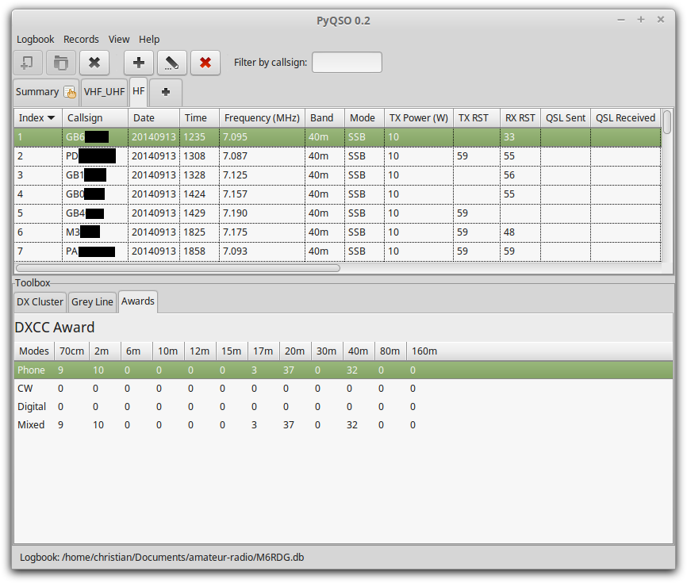
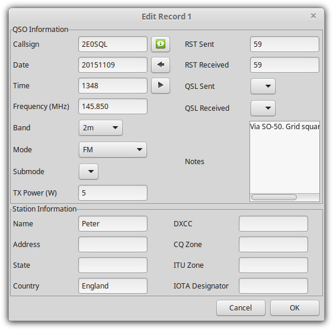
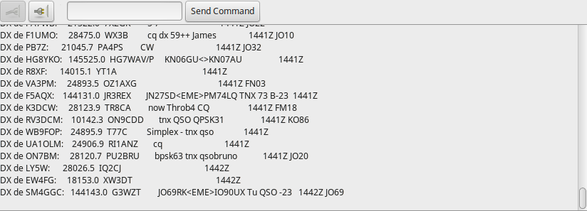
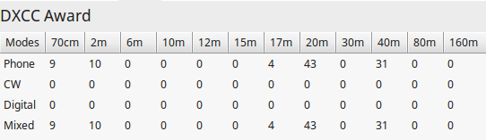

Preferences
===========

PyQSO user preferences are stored in a configuration file located at
``~/.pyqso.ini``, where ``~`` denotes the user’s home directory.

General
-------

Under the ``General`` tab, the user can choose to show the toolbox (see
Chapter [chap:toolbox]) when PyQSO is started.

The user can also enter their login details to access the qrz.com
database. Note that these details are currently stored in plain text
(unencrypted) format.

View
----

Not all the available fields have to be displayed in the logbook. The
user can choose to hide a subset of them by unchecking them in the
``View`` tab. PyQSO must be restarted in order for any changes to take
effect.

Hamlib support
--------------

PyQSO features rudimentary support for the Hamlib library. The name and
path of the radio device connected to the user’s computer can be
specified in the ``Hamlib`` tab of the preferences dialog. Upon adding a
new record to the log, PyQSO will use Hamlib to retrieve the current
frequency that the radio device is set to and automatically fill in the
Frequency field.

